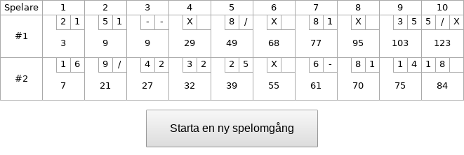

# bowling-game :bowling:

Ett bowlingspel där två personer spelar mot varandra. 

### Installation

* Installera [Node.js och npm](https://docs.npmjs.com/downloading-and-installing-node-js-and-npm)
* Installera beroenden:

```
npm install
cd client
npm install
```

#### API-server

Starta serverprogramvaran genom att ange:

```
npm start
```

Klientappen kan därefter köras i utvecklingsläge genom att ange:

```
cd client
npm start
```

&Ouml;ppna sedan http://localhost:8080/ i webbläsaren.

#### Miljövariabler

Följande miljövariabler är tillgängliga och kan (om så önskas) anges, antingen direkt eller i en `.env`-fil.

| Variabel      | Beskrivning                      | Förvalt värde |
|---------------|----------------------------------|---------------|
| PORT          | Den port som servern lyssnar på  | 4399          |
| API_URL       | Serverns url (plockas upp av Webpack) | ht&#8203;tp://localhost:4399 |

### Beskrivning

En omgång startar med att användaren klickar på en knapp och genererar ett slumpvis resultat. Förloppet visas i tabellform. Vanliga [bowlingregler](http://www.alltombowling.nu/skola_rakna.php) gäller. Spärr och strike ska också kunna genomföras.

### Lösning



#### Demo

Spela direkt online: https://laserpants.github.io/bowling-game/client/dist/

Lösningen består av en API-del samt en klientdel. 

#### HTTP-API

Gemensamt för samtliga anrop är att de returnerar ett objekt med attributet `game`. Detta objekt har i sin tur följande underattribut:

| Attribut     | Typ     | Beskrivning                                |
|--------------|---------|--------------------------------------------|
| id           | string  | En unik identifierare för spelomgången      |
| complete     | boolean | Indikerar huruvida omgången är avslutad eller ej |
| frames<sup>†</sup> | Array   | Resultat för varje enskild uppställning    |
| score        | Array   | Poäng efter varje uppställning             |
| currentTotal | number  | Total poängsumma i spelets nuvarande skede |

† Resultatet listas som en array där varje element i sin tur är en array med ett eller två element, förutom sista uppställningen som består av två eller tre element. T.ex. `[4, 3]` innebär att fyra käglor slogs ut i första slaget, och tre i det andra.

##### `POST /games`

En ny spelomgång (serie) registreras. Returnerar en identifierare (textsträng) som används i efterföljande anrop.

###### Exempel:

```
curl -X POST http://localhost:4399/games
```

```json
{
  "game": {
    "id": "1ljzlmmjoj1s0kn",
    "frames": [],
    "complete": false,
    "score": [],
    "currentTotal": 0
  }
}
```

##### `POST /games/:game_id/frames`

Avancerar en pågående spelomgång genom att beräkna en ny uppställning. Vid en uppställning har spelaren två försök att välta samtliga käglor. Se [nedan](#bakgrund) för resonemang kring denna process. Om spelomgången redan är avslutad returneras felkoden `410 Gone`.

Detta anrop returnerar också ett attribut `frame` beskrivande den uppställning (frame) som lagts till. 

###### Exempel:

```
curl -X POST http://localhost:4399/games/1ljzlmmjoj1s0kn/frames
```

```json
{
  "game": {
    "id": "1ljzlmmjoj1s0kn",
    "frames": [
      [ 9, 0 ],
      [ 4, 2 ],
      [ 8, 0 ],
      [ 6, 2 ],
      [ 0, 8 ]
    ],
    "complete": false,
    "score": [ 9, 15, 23, 31, 39 ],
    "currentTotal": 39
  },
  "frame": [ 0, 8 ]
}
```

##### `GET /games/:id`

Visar information om ett pågående eller avslutat spel.

###### Exempel:

```
curl http://localhost:4399/games/1ljzlmmjoj1s0kn
```

```json
{
  "game": {
    "id": "1ljzlmmjoj1s0kn",
    "frames": [
      [ 9, 0 ],
      [ 4, 2 ],
      [ 8, 0 ],
      [ 6, 2 ],
      [ 0, 8 ]
    ],
    "complete": false,
    "score": [ 9, 15, 23, 31, 39 ],
    "currentTotal": 39
  }
}
```

#### Poängberäkning 

Se till exempel: http://slocums.homestead.com/gamescore.html

#### Klient

Klientappen är webbläsarbaserad och bygger på JavaScript och React.

### Plan

| Dag           | Aktivitet                   | Timmar     |    |
|---------------|-----------------------------|------------|----|
| M&aring;ndag  | Projektupplägg              | 1-3 timmar | :heavy_check_mark: |
| Tisdag        | API                         | 1-3 timmar | :heavy_check_mark: |
| Onsdag        | API                         | 1-3 timmar | :heavy_check_mark: |
| Torsdag       | Klientapp                   | 1-3 timmar | :heavy_check_mark: |
| Fredag        | Klientapp                   | 1-3 timmar | :heavy_check_mark: |
| L&ouml;rdag   | Test och dokumentation      | 1-3 timmar | :heavy_check_mark: |
| S&ouml;ndag   | :tada: Premiärfest på Café Opera? |      | Inställt p.g.a. stambyte |

| Dag           | Aktivitet                   | Timmar     |
|---------------|-----------------------------|------------|
| Vecka 2       | Utforska alternativa idéer (se nedan) | 3-6 timmar |

### Bakgrund

```
6 7 8 9
 3 4 5
  1 2 
   0
```

Spelaren genomför ett eller två slag vid varje uppställning. Detta resulterar i en av 2^10 = 1024 möjliga konfigurationer av käglor, där varje enskild kägla antingen kan ha slagits ut eller lämnats intakt. T.ex.,

```
6 7 8 9    - - - 9    6 7 8 9    - - - -    6 7 8 9
 - - 5      - 4 -      - - -      - - -      3 - 5
  1 -        - -        - -        - -        1 2
   0          0          0          -          0
```

#### En kort parentes om alternativa idéer

I ett färdighetsbaserat spel (vilket riktig bowling i allra högstra grad är) kan man tänka sig att spelaren styr förloppet genom att använda t.ex. muspekaren eller tangentbordet. En fysikmotor, som Box2D, kan då användas för att beräkna klotets rörelse och samverkan med käglorna, genom vilket man uppnår ett mer intressant resultat.

##### Simulering

En annan rolig variant skulle vara att spelaren har möjlighet att ange ett antal inparametrar och att spelförloppet bygger på någon Game of Life-liknande simulering där de mönster som uppstår avgör vilka käglor som träffas av klotet. Detta kan vara värt att utforska senare.

#### En slumptalsbaserad modell

I den nuvarande lösningen har spelaren inte någon möjlighet att påverka resultatet, utan vi förlitar oss på slumpen och en naiv sannolikhetsfördelning.

Låt *k* vara antalet käglor spelaren slår ut i första slaget och *j* antalet utslagna käglor i andra slaget, där *0 ≤ k ≤ 10* och *0 ≤ j ≤ (10 - k)*. För enkelhets skull antar vi att *P(k = k₀) = 1:11* för samtliga *k₀* och *P(j = j₀) = 1:(10 - k + 1)* för samtliga *j₀*. Om vi vill veta exakt vilka käglor som slagits ut (dvs. inte bara antalet) finns det *C(10, k)* möjliga sätt att slå ut *k* käglor, där *C(n, k)* är binomialkoefficienten (*n* över *k*), och vi kan åter igen använda en uniform sannolikhetsfördelning över denna mängd. Detta är inte speciellt realistiskt om man tar i beaktande, t.ex., de två konfigurationerna nedan, där den till höger inträffar betydligt oftare än den till vänster. Vi bortser dock för tillfället från dessa mer teoretiska problemställningar.

```
6 7 8 9   6 7 8 -
 3 - 5     3 4 5
  1 2       1 2
   0         0
```

### Enhetstester

Testerna är baserade på ramverket Mocha och kan köras genom att ange:

```
npm test
```

### Dokumentation

För att generera dokumentation:

```
npm run docs
```

Filerna placeras under `./docs/`.

```
xdg-open docs/index.html
```
